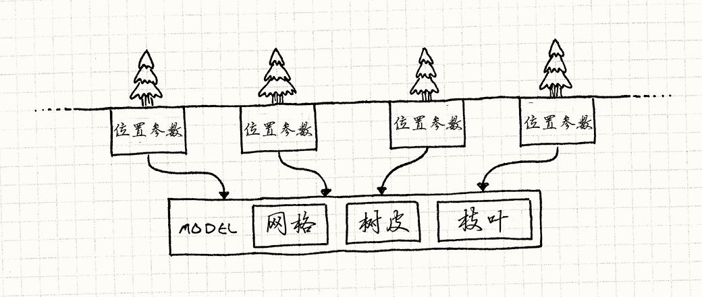
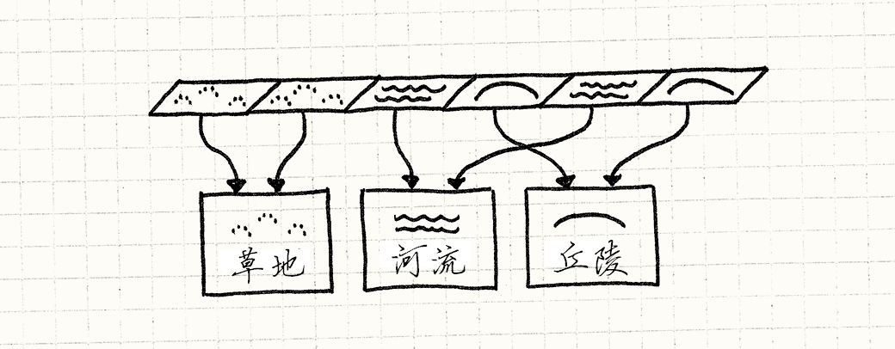

# 享元模式

简而言之，享元模式就是将对象的数据分为两部分，其中一部分没有特定指明是哪个对象的实例，因此可以在它们间共享，GoF 称这部分为 “固有状态”，一个很常见的例子便是开放世界中的树林的渲染和瓦片地图的数据存储方式

享元模式是对内存和开发者友好的，它可以通过减少重复部分数据避免内存冗余，并且通过合并类来减轻程序员的管理负担

## 巨大的森林

显而易见，在当下的技术水平来看，无论是多么细致逼真、制作精良的开放世界游戏，游戏中类似森林这种元素个体变化极多的存在，建模师都不会为每一个个体单独建立一个独立的模型，这不仅对建模师不公平，对程序而言也十分不友好  

我们很容易想到，我们可以存储树的 “各部分”，然后通过程序将一棵棵相态各异的树 “拼凑” 成一个完整的对象，如果用代码表示，那么会得到这样的东西：

```c++
class Tree
{
private:
    Mesh mesh_;
    Texture bark_, leaves;
    Vector position_;
    double height_, thickness_;
    Color barkTint, leafTint;
};
```

但是到此为止，我们还没有使用享元模式，部分到整体的思想不是享元模式的核心，享元模式的关键在于将这些拆分开的部分中的重复元素找出并且合并，所以我们就有了下面的代码：

```c++
class TreeModel
{
private:
    Mesh mesh_;
    Texture bark_, leaves;
};

class Tree
{
private:
    TreeModel* model_;
    Vector position_;
    double height_, thickness_;
    Color barkTint, leafTint;
};
```

也就是下图所展现的内容：



这有点像 “[类型对象模式](./类型对象模式.md)”，两者都设计将一个类中的状态委托给其他类来存储或处理，来达到不同实例间共享状态的目的，但是两者的初衷并不相同，具体区别如下：

+ 使用类型对象的主要目的是将类型引入对象模型，减少定义类的数量，而共享内存则是水到渠成的好处

+ 享元模式则是从优化效率的角度出发，实例间共享数据并不是在设计享元类时应该首要考虑的方面

在真正调用图形接口进行渲染时，我们可以把共享的数据 `TreeModel` 只像 GPU 发送一次，而对每棵树独立的数据分别发送，现代的图形接口和显卡都支持这样的渲染方式，具体细节不再赘述

Bob Nystrom 在《Game Programming Patterns》 中总结道：

> 这个 API 是由显卡直接实现，意味着享元模式也许是唯一有硬件支持的 GoF 设计模式

## 地图数据

瓦片地图的使用在现代的游戏中也依然十分活跃，虽然它的表现不一定如某些老旧的地牢RPG游戏那样边界规整、分明，如 我的世界、泰拉瑞亚 等游戏就是瓦片地图的经典应用

和上述的森林渲染一样，我们自然也不会让每一个瓦片或每一类瓦片都占据一个独立的类，它们的大部分数据还是同样可以合并的

我们可以首先定义地形的枚举种类：

```c++
enum Terrain
{
    TERRAIN_GRASS,
    TERRAIN_HILL,
    TERRAIN_RIVER
    // 其他地形……
};
```

然后将 “世界” 定义为巨大的网格：

```c++
class World
{
private:
    Terrain tiles_[WIDTH][HEIGHT];
}
```

使用嵌套数组存储 2D 网格，在 C/C++ 这类语言中是很有效率的，因为它会将这些元素在内存中 “真正地” 打包到一起，这将有利于缓存命中，更多内容可以查看 “[数据局部性](./数据局部性.md)” 这一章节；但是在 Java 或其他内存管理语言中，底层的实现可能并不会是这样，但这并不是我们在此时应该关心的内容，我们只需要隐藏 2D 网格数据结构的实现细节，让代码尽可能保持简洁

这样，如果我们想获取玩家角色在不同地形上的移动开销，或判断某处地形是否是水域时，我们就可以这样写：

```c++
int World::getMovementCost(int x, int y)
{
    switch (tiles_[x][y])
    {
        case TERRAIN_GRASS: return 1;
        case TERRAIN_HILL: return 3;
        case TERRAIN_RIVER: return 2;
        // 其他地形……
    }
}

bool World::isWater(int x, int y)
{
    switch (tiles_[x][y])
    {
        case TERRAIN_GRASS: return false;
        case TERRAIN_HILL: return false;
        case TERRAIN_RIVER: return true;
        // 其他地形……
    }
}
```

但是，这样的设计并不是优雅的，移动开销和水域标识本应是地图区块的数据，但是我们却通过外部的方法将这些数据拆散开了，这违背了我们设计对象的初衷

所以我们就可以将上述原本属于 `World` 这个类的方法拆分合并到 `Terrain` 类的属性和方法中，代码如下：

```c++
class Terrain
{
public:
    Terrain(int movementCost, bool isWater, Texture texture)
        : movementCost_(movementCost), isWater_(isWater), texture_(texture) {}
    int getMovement() const { return movementCost_; }
    bool isWater() const {return isWater_; }
    const Texture& getTexture() const { return texture_; }

private:
    int movementCost_;
    bool isWater_;
    Texture texture_;
}
```

你可能注意到了，这里我们多处使用了 `const` 来进行限定，这是为了防止对这些多处共享的对象错误地修改而造成违背开发者意愿的事情发生

但是我们可能对这种代码处理方式还是不太满意，因为我们将应用的显示行为（如获取移动开销和水域判定这些逻辑行为）绑定到了类内部，从而让享元对象变为几乎不可改变的状态，似乎有些优化过度了；但是我们也不想为每个区块都在内存中保存一个实例——如果仔细观察就可以发现，其实地形无非就寥寥几种，而整张地图无非就是保存每一种区块出现在何处：

> 用享元的术语讲，区块的所有状态都是 “固有的” 或者说 “上下文无关的”

鉴于此，我们就没必要开辟多块内存分别保存多个同种地形类型的数据，地面上的草区块享元数据两两无异，所以我们就可以用 `Terrain` 对象指针组成网格：

```c++
class World
{
private:
    Terrain* tiles_[WIDTH][HEIGHT];
    // 其余代码……
}
```

这时的世界地图就变成了下面这幅样子：



由于地形实例可能在游戏中会多处使用，如果想要动态分配，它们的生命周期可能就会比较复杂，所以，我们可以直接在游戏世界中存储它们：

```c++
class World
{
public:
    World()
        : grassTerrain_(1, false, GRASS_TEXTURE),
          hillTerrain_(3, false, HILL_TEXTURE),
          riverTerrain_(2, true, RIVER_TEXTURE)
        {}

private:
    Terrain grassTerrain_;
    Terrain hillTerrain_;
    Terrain riverTerrain_;
}
```

这样，我们就可以通过下面的代码生成地图：

```c++
void World::generateTerrain()
{
    // 生成山地和草地地形
    for (int x = 0; x < WIDTHl x++)
        for (int y = 0; y < HEIGHT; y++)
            if (random(10) == 0)
                tiles_[x][y] = &hillTerrain_;
            else
                tiles_[x][y] = &grassTerrain_;
    // 生成河流
    int x = random(WIDTH);
    for (int y = 0; y < HEIGHT; y++)
        tiles_[x][y] = &riverTerrain_;
}
```

我们现在不需要在 `World` 中通过方法接触地形属性，而是可以直接暴露出 `Terrain` 对象：

```c++
const Terrain& World::getTile(int x, int y) const
{
    return *tiles_[x][y];
}
```

使用这种方式，`World` 就不再与各种地形细节耦合，如果想获取某一区块的属性，就可以直接从对应区块对象中获得：

```c++
World world;
world.generateTerrain();
int cost = world.getTile(2, 3).getMovementCost();
```

我们现在又回到了直接操作实体对象的 API，但是由于指针通常情况下是远小于枚举类型的，所以这样的操作性能更优，几乎没有任何额外开销

## 拓展

+ 在实际游戏开发过程中，我们一般不会在游戏一开始就创建好所有的享元，这样的设计在多数情况下是很丑陋的（如游戏中分为多个世界，而每个世界中的地形享元都不同，在当前世界中加载其他世界的享元到内存中就成了额外的负担）；如果我们不能预料什么时候才会真正需要这些享元，那么一个显而易见的策略便是在需要的时候才去创建它；同时，为了保持共享的优势，我们在尝试创建一个享元的时候，必须先判断是否已经存在了一个相同的实例，这听起来像 “[单例模式](./单例模式.md)”，但是如果我们将构造函数封装在查询对象是否存在的接口之后，使用 “工厂方法” 会是更好的选择

+ 为了返回一个早些时候创建的享元对象，我们可能需要追踪已经实例化的全部享元对象，这时，“[对象池](./对象池.md)” 便派上用场了

+ 在使用 “[状态模式](./状态模式.md)” 时，经常会出现一些没有任何特定字段的 “状态对象”，但这个状态的标识和方法都很有用，在这种情况下，享元模式就可以在不同的状态机上使用相同的对象实例