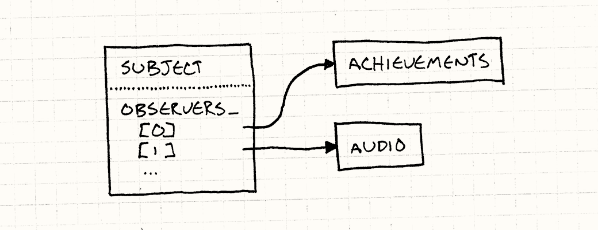
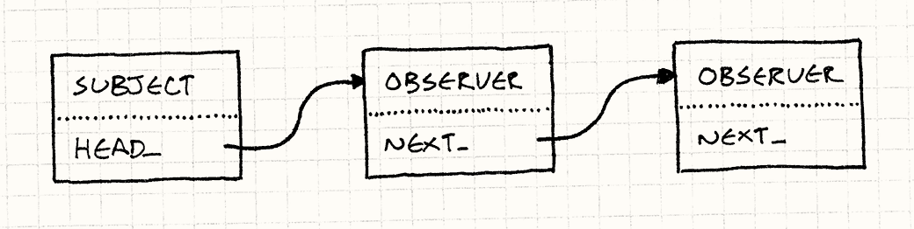
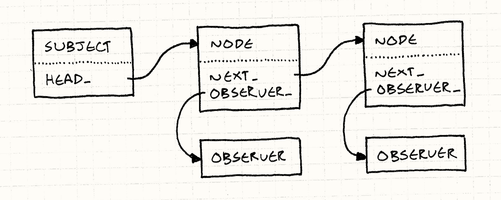

# 观察者模式

观察者模式可能是应用最为广泛的设计模式了，Java 将它放到了自己的核心库 `java.util.Observer` 中，C# 更是将其通过 `event` 关键字把它嵌入到了自己的语法中

一种常见的定义可以把它描述为：

> 一个目标物件管理所有相依于它的观察者物件，并且在它本身的状态改变时主动发出通知。这通常透过呼叫各观察者所提供的方法来实现。此种模式通常被用来实现事件处理系统

在游戏中最常见的用途便是 “成就系统”

## 成就系统

在游戏中，成就系统存储了玩家完成的各种各样的挑战，譬如 “通过穿模让自己从桥面上掉下去”（虽然一般来说，严谨的游戏开发者都不会在游戏的最终发布版本中设计此类成就），也就是说，在处理 “从桥上掉落” 这个物理引擎相关的代码部分，必须要对诸如 `unlockFallOffBridge()` 的方法进行调用，那么，成就系统便和物理系统紧密地耦合到了一起，而诸如 “在当前关卡回档 1000 次” 这类成就，可能又会和存档系统进行交互，代码又会交织成一团乱麻……

那么，我们该如何解耦成就系统和其他它所关心的系统之间的关系呢？

观察者模式就是处理这类棘手问题的专家！

例如，一个常见的物理系统可能会处理重力，追踪哪些游戏对象待在地表，哪些坠入深渊，为了实现上述的桥面掉落成就，我们可以这样做：

```c++
void Physics::updateEntity(Entity& entity)
{
    bool wasOnSurface = entity.isOnSurface();
    entity.accelerate(GRAVITY);
    entity.update();
    if (wasOnSurface && !entity.isOnSurface())
        // 如果更新之前位于桥面而更新后不在桥面上，则将 “开始坠落” 事件广播出去
        notify(entity, EVENT_START_FALL);
}
```

这段代码所做的事情就仿佛在说，“额，我不知道谁对这件事感兴趣，但是刚才那个东西掉下去了，你们可以做自己想做的事情”

物理引擎虽然确实决定了要发送什么通知，但是这并没有完全解耦：成就系统需要检查这个正在下落的游戏对象时主角还是主角射出的弓箭，还需要检查在这之前主角有没有过类似的经历（毕竟没有人希望自己在每次掉下桥时都能收到礼花和炫光相伴的成就解锁），这些代码都无需牵扯物理引擎

仔细思考一下，`notify()` 函数的具体实现似乎是一个到现在为止还没有解决的麻烦，如果我们更新了成就系统，或者坠落下桥的成就系统不再关心这件事，那么我们就可能需要动态那些正在关心的听众们的列表，所以这里就对灵活性提出了更高的要求

## 如何实现？

Talk is cheap，如果我们还不知道如何设计消息的发布者，那么就先从那些收听者们这里进行编码：

```c++
class Observer
{
public:
    virtual ~Observer() {}
    virtual void onNotify(const Entity& entity, Event event) = 0;
};
```

`onNotify()` 函数所需要的参数取决于具体的设计，典型的参数便是代码中所描述的：发送通知的对象和一个装入其他数据细节的参数；泛型或模板编程在这里可能十分有用，在这里为了方便起见，参数被硬编码为一个游戏实体和一个描述发生了什么事件的枚举

然后，成就系统我们就可以通过继承观察者类来实现：

```c++
class Achievements : public Observer
{
public:
    virtual void onNotify(const Entity& entity, Event event)
    {
        switch (event)
        {
        case EVENT_ENTITY_FALL:
            if (entity.isHero() && heroIsOnBridge_)
                unlock(ACHIEVEMENT_FELL_OFF_BRIDGE);    // 解锁成就
            break;

            // 处理其他事件的代码，更新 heroIsOnBridge_ 变量……
        }
    }

private:
    void unlock(Achievement achievement)
    {
        // 判断成就是否已经解锁并尝试解锁成就
    }

    bool heroIsOnBridge_;
};
```

被观察的对象拥有通知的方法函数，在 GoF 中，这些对象被称为 “主题”，主题会有一个列表，用来存储等它通知的观察者：

```c++
class Subject
{
private:
    Observer* observers_[MAX_OBSERVERS];
    int numObservers_;
};
```

在实际开发中，这里的 `observer_` 使用动态集合效果会更好（接下来的代码会说明这点），这里使用定长数组方便不习惯 C++ 标准库的读者们理解

关键在于主题暴露了公开的 API 来修改这个列表：

```c++
class Subject
{
public:
    void addObserver(Observer* observer)
    {
        // 将新的观察者添加到数组中……
    }

    void removeObserver(Observer* observer)
    {
        // 将观察者从数组中移除
    }

    // 其他代码……
};
```

到现在为止，这就允许了外界代码控制谁接收通知，被观察者通过主题与观察者交流，但是不相互耦合，在这个示例中，没有一行物理代码会提及成就，但是二者仍可以相互交流，这就是观察者模式的精髓之处

被观察者使用列表而不是单一变量的设计也是十分重要的，这就允许了多个观察者（可能涉及多个系统）同时对于一个目标主题做出反应，譬如音效系统可能也需要在玩家坠落桥底的时候播放合适的音乐，而单一变量则会将后面添加的观察者顶替先前观察者的位置

现在，被观察者（主题）的剩余任务就是发送通知了：

```c++
class Subject
{
protected:
    void notify(const Entity& entity, Event event)
    {
        for (int i = 0; i < numObservers_; i++)
            observers_[i]->onNotify(entity, event);
    }
};
```

注意，上面的示例假设了观察者不会在自己的 `onNotify()` 方法中修改观察者列表和观察者对象，如果观察者希望能够在收到通知时修改游戏对象的数据，那么开发者可能需要关注当前观察者列表中存在的观察者会不会对通知的顺序敏感，有时不同的通知顺序在同一个实体被修改时会产生不同的结果，毕竟看似同时通知的设计具体是通过数组的遍历先后通知实现的

回到物理系统上，我们只需要给物理系统添加挂钩让它可以发送消息，成就系统便可以和这一部分连线来接收消息，按照传统的设计模式方法实现，通过继承：

```c++
class Physics : public Subject
{
public:
    void updateEntity(Entity& entity);
};
```

注意，在先前的代码里面，我们将 `notify()` 实现为了 `Subject` 内的保护方法，这样派生的物理系统便可以调用并发出通知，但是外部代码不可以；同时，`addObserver()` 和 `removeObserver()` 是公开的，所以任何能够接触物理引擎的东西都可以观察它

在实际开发过程中，我们会避免在这里使用继承，让 `Physics` 拥有一个 `Subject` 实例，而不是直接观察物理系统本身，例如被观察的是独立的 “下落事件” 的对象，观察者可以这样注册自己：

```c++
physics.entityFell().addObserver(this);
```

关于 “观察者” 系统和 “事件” 系统的不同之处，Bob Nystrom 在《Game Programming Patterns》 中写道：

> 对我而言，这是 “观察者” 与 “事件” 系统的不同之处。使用前者，你观察做了有趣事情的事物。使用后者，你观察的对象代表了发生的有趣事情

现在，当物理系统做了值得被关注的事情，它便会调用 `notify()`，就像前面代码所展示的，它遍历了观察者列表，通知了所有观察者



简单来说，只需要一个类管理一个列表指向接口实例的指针

> 很简单，对吧？难以置信的是，如此直观的东西是无数程序和应用框架交流的主心骨

## 观察者模式的缺陷？

### 太慢了……

设计模式似乎总是被诟病效率太低，而观察者模式的名声似乎格外坏，因为一些名声不好的东西和他如影随形，譬如 “事件”，“消息”，甚至是 “数据绑定”

计算机科学理论中很重要的一点便是 “权衡”，一个很简单的例子便是在算法领域设计时所考虑的时间和空间之间的权衡，在宏观的开发过程中，代码的表达能力和可维护性与程序的效率在一定程度上也是存在制约关系的

其实有些时候并不是狂热的性能追求者们所想的那样，以上述为例，发送通知知识简单地遍历列表，调用一些虚方法，虽然这确实会比静态调用慢一点，但是使用这个模式可以为乱如麻的系统交互代码解耦，为后续的维护迭代创造非常清爽的后路，这一点性能的牺牲完全是可以忽略的

### 太快了？

在上述代码设计中，我们注意到一个问题：被观察者直接调用了观察者，这就意味着只有在所有观察者的通知方法返回后，被观察者才会继续完成自己的工作；简而言之，那便是 “观察者会阻塞被观察者的运行”

有经验的读者可能很快想到了使用多线程或事件同步，是的，无论如何，我们都是想要让它尽可能快地返回，这样才不会让整个游戏程序卡在这里

但是，必须要小心在观察者使用线程和锁，如果观察者试图获得被观察者的锁，游戏就会进入到死锁中，在多线程引擎中，使用 “[事件队列](./事件队列.md)” 来进行异步通信是一个很不错的选择

### 太多的动态分配！

确实，正如之前所说的，在实际的开发中，观察者列表的长度通常是动态修改的，即使是在有垃圾回收机制的语言中，内存分配和回收同样需要时间，即使这些工作都是自动进行的，另外，内存分页也是问题

使用 “[对象池](./对象池.md)” 或许是一个不错的思路，又或者我们可以尽可能地在游戏一开始就加入所有观察者而不乱动它们，除此之外，我们或许还可以这样做：

+ 链式观察者

    在上述的代码中，`Subject` 只是拥有了一列表指针指向观察它的 `Observer` ，而 `Observer` 本身并没有对这个列表进行引用，它是纯粹的虚接口，而没有使用有状态的类

    但是如果我们在 `Observer` 中存放一些状态，那么我们就可以将观察者列表分布到观察者自己身上来解决动态分布的问题：简单来说，就是不再让主题（被观察者）保留指针列表，而是让观察者对象本身成为链表的一部分

    

    为了实现这一点，`Subject` 中就不能再使用数组，而是保存链表的头部指针：

    ```c++
    class Subject
    {
    public:
        Subject() : head_(NULL) {}

        // 其他代码……

    private:
        Observer* head_;
    };
    ```

    然后，我们需要继续修改 `Observer` 类，让它拥有指向链表下一观察者节点的指针：

    ```c++
    class Observer
    {
        friend class Subject;

    public:
        Observer : next_(NULL) {}

        // 其他代码……
    
    private:
        Observer* next_;
    }
    ```

    一个小细节，我们让 `Subject` 成为了友类，这样被观察者就拥有了增删观察者的 API；注册一个观察者到链表中，我们使用最简单的方式来实现，直接让它插入到链表的头部：

    ```c++
    void Subject::addObserver(Observer* observer)
    {
        observer->next_ = head_;
        head_ = observer;
    }
    ```

    另一种选择就是让观察者添加到链表的尾部，这样我们就需要保存一个单独的 `tail_` 指针指向链表的最后一个节点或者遍历整条链表；正像我们前面所说的，当前观察者链表中存在的观察者不应该对通知的顺序敏感，如果能够保证做到这一点，那么直接将其添加到链表头部会是更简明的策略

    下一步是完成观察者的移除操作：

    ```c++
    void Subject::removeObserver(Observer* observer)
    {
        if (head == observer)
        {
            head_ = observer->next;
            observer->next = NULL;
            return;
        }

        Observer* current = head_;
        while (current != NULL)
        {
            if (current->next_ == observer)
            {
                current->next_ = observer->next_;
                observer->next_ = NULL;
                return;
            }

            current = current->next_;
        }
    }
    ```

    本质还是对链表节点的添加和删除操作，相信熟悉链表这一数据结构的读者可以很轻松理解；当然，删除节点时可以使用指向指针的指针实现更优雅的操作来应对头结点的情况，但是为了示例代码的简明起见，还是使用丑陋的 `if` 进行特殊情况处理

    另外，在实际的项目中，通常会使用双向链表而不是单向，这样我们只需要常量时间便可以移除一个观察者

    剩下的事情就是发送通知了，这和遍历数组一样简单：

    ```c++
    void Subject::notify(const Entity& entity, Event event)
    {
        Observer* observer = head_;
        while (observer != NULL)
        {
            observer->onNotify(entity, event);
            observer = observer->next_;
        }
    }
    ```

    在这里，我们遍历了整条链表，通知到了每一个观察者，但是这是在所有观察者相互独立且拥有相同优先级的前提之下的，如果我们需要观察者在收到通知时告知我们来决定是否继续向下遍历链表，这就十分接近 “职责链模式” 了

    注意，由于我们使用了观察者对象作为链表的节点，这就限制了它只能存在于一个观察者链表中，通俗而言，也就是说：一个观察者一次只能观察一个主题；而在通常的实现中，一个观察者可能需要观察多个不同的主题（如是首次否坠落下桥的主题可能需要同时观察物理系统和存档系统），这就是下面要记录的这种实现方式了……

+ 链表节点池

    没错，现在依然是链表，但是每个节点不再是对象，而是一个完全由指针组成的结构，它保存了两个指针：一个是下一个节点的 `next_` 指针，另一个是指向真正观察者对象的 `observer_` 指针，如下图所示：

    

    > 后者的风格被成为 “侵入式” 链表，因为在对象内部使用链表侵入了对象本身的定义。侵入式链表灵活性更小，但如我们所见，也更有效率。在 Linux 核心这样的地方这种风格很流行

    那么，该如何避免内存动态分配呢？很简单，由于这些节点都是同样的大小和类型，我们可以预先在 “[对象池](./对象池.md)” 中分配它们

## 善后问题

一个十分常见且可能导致严重后果的事情可能发生：如果我们不小心在某个观察者的代码中调用了 `delete`，观察者被成功地销毁了，但那是被观察者却还保留着指向它的指针，指向的是一片已经被释放的内存区域，如果被观察者试图通过发送一个通知，那么后果可能会让这个游戏崩溃

Bob Nystrom 在书中抱怨说，似乎大部分的设计模式类书籍都没有说明这个问题

删除被观察者更容易些，因为在多数实现中观察者没有对他的引用；但是，直接删除被观察者有些时候也会产生问题：当观察者仍认为自己在观察某个主题时，并且希望收到来自它的消息，这时它的愿望就会落空；所以，我们需要给它的析构函数添加 `removeObserver()`

> 通常在这种情况下，难点不再如何做，而在记得做

综上，在内存释放时，我们最好需要考虑清楚两点情况：一，我们需要让被观察者知晓某个观察者已经离开；二，我们需要让观察者知道自己观察的主题已经失效

Bob Nystrom 在书中提及了更安全的方案，那就是使用双向指针实现自动取消注册，但这极大地增加了代码的复杂度，相信只有对指针管理熟练的程序员才能完全驾驭得了它

即使在拥有内存自动管理机制的语言中，这一部分内存释放的问题同样需要谨慎对待，多数内存回收会进行引用计数，当我们仍在代码的某处留存有对观察者或被观察者的引用时，它们并不会得到真正的释放，这就会无形之中浪费 CPU 循环和内存占用，而且在多数情况下这种错误更不容易让人察觉；在通知系统中，这种情况的专名叫 “失效监听者问题”

## 拓展

观察者在许多代码中都有极其相似的实现，它无非做了两件事：

+ 获知有状态改变了
+ 下命令改变一些数据来反映新的状态

> 计算机科学学术界和软件工程师已经用了很长时间尝试结束这种状况了。这些方式被赋予了不同的名字：“数据流编程”，“函数反射编程” 等等

特例如 “数据绑定”，它不再指望完全弃用命令式代码，也不尝试基于巨大的声明式数据图标架构整个应用，它只是自动改变 UI 元素或计算某些数值来反映值的变化

和声明式系统类似，数据绑定还是太慢，作为游戏引擎核心的代码也太过复杂；经典的观察者模式虽然不如热门技术中充满着 “函数” “反射” 等等，但是它仍在简单且高效地工作着

Bob Nystrom 在书中说道：

> 对我而言，着通常是解决方案最重要的条件