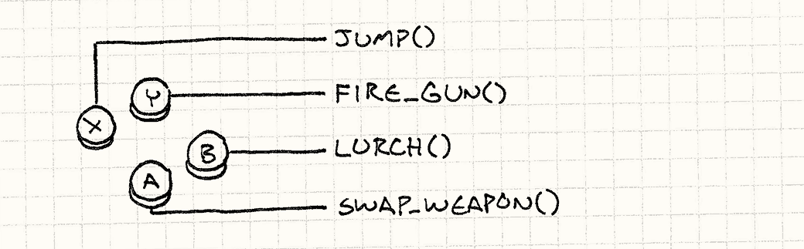
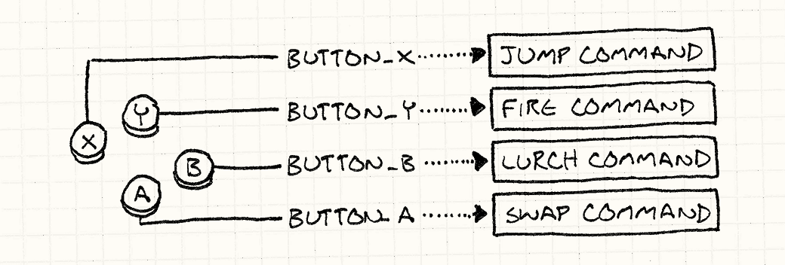
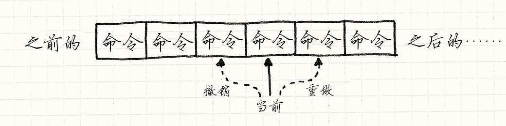

# 命令模式

GoF 中的定义：

> 将一个请求封装为一个对象，从而使你可用不同的请求对客户进行参数化；对请求排队或记录请求日志，以及支持可撤销的操作。

> 命令模式是一种回调的面向对象实现。

简而言之，便是将 “操作” 封装为类，将其实例化为对象后作为 “第一公民” 对待，一个通俗易懂的应用便是如绘图软件中的 `Ctrl+Z` 撤销功能

## 角色按键控制

以手柄为例，四个按键 `X Y B A` 分别对应角色的 `Jump FireGun Lurch SwapWeapon` 四个行为，如下图所示：



那么，可以轻松想到的代码便是下面这种：

```c++
class InputHandler
{
public:
    void handleInput();
};

void InputHandler::handleInput()
{
    if (isPressed(BUTTON_X)) jump();
    else if (isPressed(BUTTON_Y)) fireGun();
    else if (isPressed(BUTTON_A)) swapWeapon();
    else if (isPressed(BUTTON_B)) lurchIneffectively();
}
```

虽然这样的代码可以完成功能，但是由于按键响应是硬编码的，所以无法做到根据玩家的习惯或意愿在游戏的 “设置” 中修改按键键位，那么，最简单的命令模式便出现了，我们首先定义一个用来描述 “命令” 的基类，来代表可触发的游戏行为：

```c++
class Command
{
public:
    virtual ~Command() {}
    virtual void execute() = 0;
};
```

然后将刚才直接调用的指令函数封装到类中，便是下面这种代码：

```c++
class JumpCommand : public Command
{
public:
    virtual void execute() { jump(); }
};

class FireCommand : public Command
{
public:
    virtual void execute() { fireGun(); };
};

// 其余指令代码不再赘述
```

然后在刚刚剥离出去的 `InputHandler` 输入处理类中，只需要为每个按键存储一个指向指令的指针：

```c++
class InputHandler
{
public:
    void handleInput();

private:
    Command* buttonX_;
    Command* buttonY_;
    Command* buttonA_;
    Command* buttonB_;
};

void InputHandler::handleInput()
{
    if (isPressed(BUTTON_X)) buttonX_->execute();
    else if (isPressed(BUTTON_Y)) buttonY_->execute();
    else if (isPressed(BUTTON_A)) buttonA_->execute();
    else if (isPressed(BUTTON_B)) buttonB_->execute();
}
```

现在，在每次按键后，会通过一层间接寻址调用函数，示意图如下：



注意，这里的代码并没有对 `NULL` 进行单独检测，而在实际的游戏开发过程中，可能并不是每一个手柄上或键盘上的按键都对应着一个命令，这时我们便可以定义一个单独的空命令类继承自命令基类，而它的执行函数不做任何事情，这样就可以不需要为每一个键设置为 `NULL`，而只需要指向这个类，如下方的代码：

```c++
class EmptyCommand : public Command
{
public:
    virtual void execute() {};
}
```

这种使用方式同样为一种设计模式，它的名字便是 “空对象模式”

## 解耦角色和命令

在上述内容中，我们做了一个十分有局限性的假设，那就是像 `jump() fireGun()` 等函数可以找到玩家角色，获取并修改玩家数据，就像操控木偶一样操控玩家对象，这样不仅对代码有了更多限制，而且如果想要让玩家控制不同的游戏角色，这也是无法轻易实现的。

如果我们把玩家所控制的角色变为指令执行时的参数传入，而不是让函数去寻找它们控制的角色那么上述两个问题便都可以轻而易举地解决：

```c++
class Command
{
public:
    virtual ~Command() {}
    virtual void execute(GameActor& actor) = 0;
};

class JumpCommand : public Command
{
public:
    virtual void execute(GameActor& actor) { actor.jump(); }
};

class FireCommand : public Command
{
public:
    virtual void execute(GameActor& actor) { actor.fireGun(); };
};

// 其余指令代码不再赘述
```

到目前为止我们只修改了 `Command` 类，在原先代码中真正调用 `execute()` 函数的 `InputHandler` 类同样需要修改。

我们在这里使用 “延迟调用”，不将玩家作为参数传入后在 `handleInput()` 函数中自动调用，而是将它延迟到外部手动调用，这样它在调用时才会知晓自己作用在哪个角色上：

```c++
class InputHandler
{
public:
    Command* handleInput();     // 只需要修改此处函数

private:
    Command* buttonX_;
    Command* buttonY_;
    Command* buttonA_;
    Command* buttonB_;
};

Command* InputHandler::handleInput()
{
    if (isPressed(BUTTON_X)) return buttonX_;
    else if (isPressed(BUTTON_Y)) return buttonY_;
    else if (isPressed(BUTTON_A)) return buttonA_;
    else if (isPressed(BUTTON_B)) return buttonB_;

    return NULL;    // 如果没有按键被按下，则不进行任何处理
}
```

我们在实际调用时只需要这样写：

```c++
GameActor actor;
InputHandler inputHandler;
Command* command = inputHandler.handleInput();
if (command) command->execute(actor);
```

有了这样的代码，我们便可以让玩家轻松控制不同的角色而不需要为每个角色单独编写按键响应代码；同样，如果我们想让AI托管玩家或为游戏中新增和玩家行为相似的AI，只需要让AI生成 `Command` 对象便可以做到

如果我们把这些指令序列化，通过网络传输到另一台机器上，再反序列化重现出来，这样我们就可以实现网络多人游戏的基础部分了

## 撤销和重做

这个例子可能是命令模式最广为人知的使用场景了

如果一个命令对象可以做一件事，那么它也一定可以撤销这件事——这在策略类游戏中很常见（如悔棋等），或者在各类编辑器中，回滚使用者的操作（如PS或各类文本编辑器）

在游戏中，移动某个角色的命令类代码可能是下面这样：

```c++
class MoveUnitCommand : public Command
{
public:
    MoveUnitCommand(Unit* unit, int x, int y)
        : unit_(unit), x_(x), y_(y) {}
    virtual void execute() { unit->moveTo(x_, y_); }

private:
    Unit* unit_;
    int x_, y_;
};
```

我们可以看出，这里使用的命令与前面所说的有所不同，我们将被修改的角色通过构造函数传入到了指令对象中，并且保存在了指令对象内，而不是如之前所说的通用移动命令，这样的移动命令代表 “某回合中某一角色的特定移动”，这在晚些时候讲述的撤销中就显得有用起来了

对应的按键处理函数可能是下面这样：

```c++
Command* handleInput()
{
    Unit* unit = getSelectedUnit();      // 首先调用函数获取需要修改的对象

    if (isPressed(BUTTON_UP)) return new MoveUnitCommand(unit, unit->x(), unit->y() - 1);
     
    if (isPressed(BUTTON_DOWN)) return new MoveUnitCommand(unit, unit->x(), unit->y() + 1);

    // 其余移动代码不再赘述

    return NULL;
}
```

注意像 C++ 这种需要手动垃圾管理的语言，接收并执行上述函数返回的命令的代码也需要负责释放对象内存

接下来我们为这些类稍作修改，让他们优雅地支持撤销功能：

首先应该修改的是 `Command` 基类，新增 `undo()` 函数：

```c++
class Command()
{
public:
    virtual ~Command() {}
    virtual void execute() = 0;
    virtual void undo() = 0;        // 新增撤销函数
};
```

然后在 `MoveUnitCommand` 移动命令类中实现撤销逻辑，由于需要回到之前的状态，所以我们也需要保存角色移动前的位置信息：

```c++
class MoveUnitCommand : public Command
{
public:
    MoveUnitCommand(Unit* unit, int x, int y)
        : unit_(unit), xBefore_(0), yBefore_(0), x_(x), y_(y) {}
    virtual void execute()
    {        
        xBefore_ = unit_->x(), yBefore_ = unit_->y();      // 保存移动前的角色位置信息
        unit->moveTo(x_, y_);
    }

    virtual void undo() { unit_->moveTo(xBefore_, yBefore_); }

private:
    Unit* unit_;
    int xBefore_, yBefore_, x_, y_;
}
```

这看起来像 “备忘录” 模式，不过命令趋向于储存、修改和恢复对象的某一小部分（如移动命令只关心角色单位的位置信息），而不是对角色对象的全部状态储存快照，这种定制化存储修改的设计在内存上消耗更少

想要支持多重撤销也很容易实现，在多数支持撤销的编辑器中，多重撤销是最基本的功能之一：我们只需要记录指令列表，然后使用指针记录 “当前” 指令，当新的指令出现时，我们将其添加到列表尾部，并且将 “当前” 指针指向它；而撤销和重做就可以实现为指针的后退和前进，示意图如下：



需要注意的是，如果用户在撤销后向列表中添加了新的命令，那么则需要先清除 “当前” 指针所指命令后的所有命令，再将新的命令添加进去，配合日常的使用经验很容易理解

重做在游戏中并不常见，但是重放很常见，一种简单的重放便是记录游戏每帧的状态，但是这样会消耗大量的内存；如果游戏引擎只记录每个实体每帧运行的命令（甚至记录间隔不需要像 “每帧” 这样频繁），重放时只需要正常运行一遍所记录的命令，便可以实现内存消耗相对更优的回放，推测王者荣耀中的游戏回放可能使用了此模式

## 用类还是函数？

上述代码中使用类来编写的主要原因是 C++ 对第一公民函数的支持十分有限，函数指针没有状态，所以需要定义类来存储各种状态

Bob Nystrom 在《Game Programming Patterns》 中写道：

> 命令模式是为一些没有闭包（closure）的语言模拟闭包

闭包是自动包装状态的完美解决方案，但是它们由于过于自动化而很难看清包装的真正状态有哪些，所以有时定义一个有字段的真实类更能帮助读者理解命令关心哪些数据

以 JavaScript 为例，前面所述的移动命令代码便可以写成：

```javascript
function makeMoveUnitCommand(unit, x, y) {
    var xBefore, yBefore;
    return {
        execute: function() {
            xBefore = unit.x();
            yBefore = unit.y();
            unit.moveTo(x, y);
        },
        undo: function() {
            unit.moveTo(xBefore, yBefore);
        }
    }
}
```

## 拓展

+ 在游戏开发过程中，可能会定义许多不同的命令类，为了更容易实现这些类，我们会定义一个具体的基类，包含一些能定义行为的更高层方法，这将命令的主体 `execute()` 转移到了 “[子类沙箱](./子类沙箱.md)” 中

+ 上述的例子中，我们明确指定了具体哪个角色会处理命令，而在某些对象模型分层复杂的情况下，我们可能需要让对象响应命令并将它传递给自己的下属对象，这就是 “职责链模式”  

+ 某些命令可能是无状态的纯粹行为，这种情况下为每个命令都生成对象就有些浪费内存了，某些命令的实例可能是等价的，所以我们就可以用 “[享元模式](./享元模式.md)” 来优化这件事  

+ 或许你也可以用万恶的 “[单例模式](./单例模式.md)” 来实现它